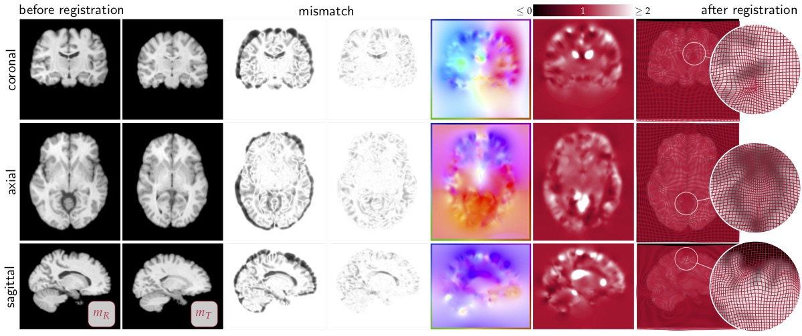

# CLAIRE

* Are you looking for **examples**? Check the [doc/examples](https://github.com/andreasmang/claire/tree/master/doc/examples) folder.
* Are in interested in **how CLAIRE works**? Check the [documentation](#clairedoc).
* Are you interested in **what CLAIRE is**? Read the [about](#claireabout) section.

## Documentation 
* [News](doc/README-NEWS.md): Recent updates and news are listed in [doc/README-NEWS.md](doc/README-NEWS.md)
* [Installation](doc/README-INSTALL.md): An installation guide can be found in [doc/README-INSTALL.md](doc/README-INSTALL.md)
* [Examples](doc/README-RUNME.md): A description of how to execute and use CLAIRE on your system can be found in [doc/README-RUNME.md](doc/README-RUNME.md).
* [Contributing](doc/CONTRIBUTING.md): If you have a bug report, a feature request, or you are interested in contributing to CLAIRE visit [doc/CONTRIBUTING.md](doc/CONTRIBUTING.md).
* [References](doc/README-REFERENCES.md): If you use CLAIRE as part of your research, please refer to [doc/README-REFERENCES.md](doc/README-REFERENCES.md) for information on citing our work.

The links above point to individual `markdown` files. These files can be found in the [doc](https://github.com/andreasmang/claire/tree/master/doc) subfolder. Basic examples for how to execute CLAIRE can be found in the [doc/examples](https://github.com/andreasmang/claire/tree/master/doc/examples) folder. The NIREP dataset used to test CLAIRE can be downloaded [here](https://github.com/andreasmang/nirep).

## About 
**CLAIRE** stands for *Constrained Large Deformation Diffeomorphic Image Registration*. It is a C/C++ software package for velocity-based diffeomorphic image registration in three dimensions. Its performance is optimized for multi-core CPU systems (`cpu` branch) and multi-node, multi-GPU architectures (`gpu` branch; default). The CPU version uses MPI for data parallelism, and has been demonstrated to scale on several supercomputing platforms. CLAIRE can be executed on large-scale state-of-the-art computing systems as well as on local compute systems with limited resources.

Notice that the CPU version is accurate and running but new features are currently only being added to the GPU version. The GPU code is a major revision and therefore considered the default and recommended for use. 

If there are any issues, you have questions, you would like to give us feedback or you have feature requests, do not hesitate to send an email to <andreas@math.uh.edu>.

If you plan on using CLAIRE in your research please cite the following manuscript:
A. Mang, A. Gholami, C. Davatzikos & G. Biros. *CLAIRE: A distributed-memory solver for constrained large deformation diffeomorphic image registration*. SIAM Journal on Scientific Computing 41(5):C548--C584, 2019 [[arxiv](https://arxiv.org/abs/1808.04487), [sisc](https://epubs.siam.org/doi/abs/10.1137/18M1207818)]. Additional references are listed [here](doc/README-REFERENCES.md).

## Contributors
George Biros, Malte Brunn, Amir Gholami, James Herring, Naveen Himthani, [Andreas Mang](mailto:andreas@math.uh.edu), and Miriam Mehl.

If you want to contribute to CLAIRE, read the guidlines (see [doc/CONTRIBUTING.md](doc/CONTRIBUTING.md)). 

## Code of Conduct
See [doc/CODE_OF_CONDUCT.md](doc/CODE_OF_CONDUCT.md).

## License
Read the [LICENSE](https://github.com/andreasmang/claire/tree/master/LICENSE) file for more details.

